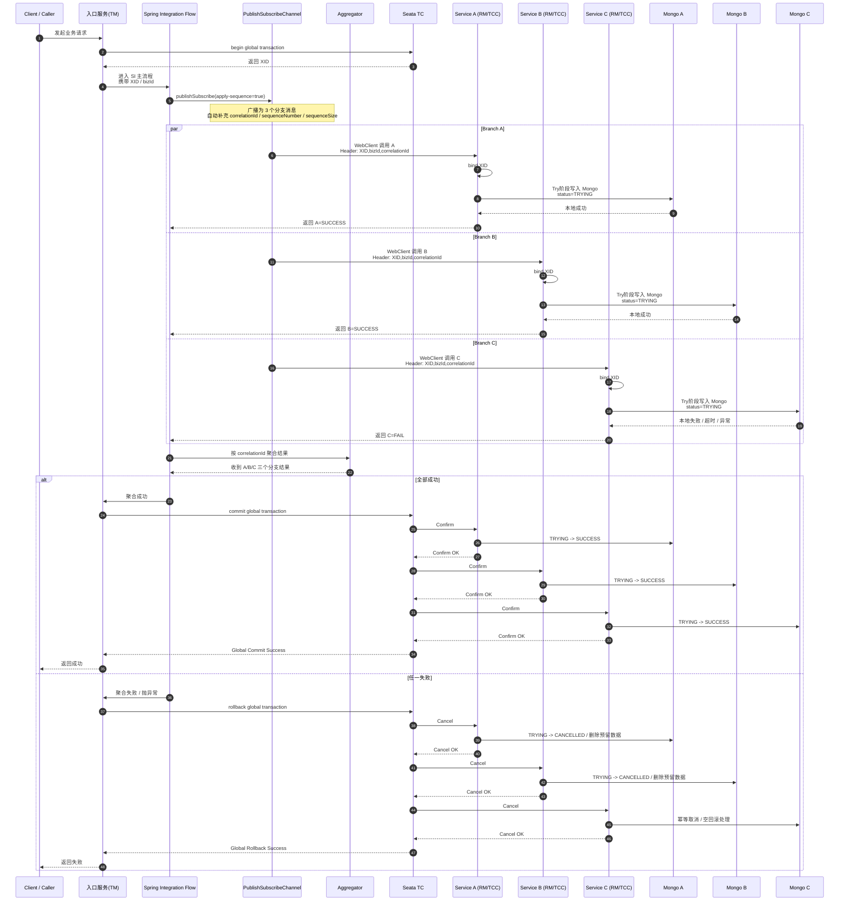

**全局事务如果要保证 A、B、C 要么都成功，要么都失败，这个“全局”归 Seata 管；Spring Integration 不负责跨服务的全局一致性**。
Spring Integration 负责的是**流程编排、消息分发、聚合、线程模型、错误流转**，它自己不是分布式事务协调器。([Home][1])

你可以先这样记：

* **SI 事务**：偏“流程内、本地、同线程/同资源”的事务边界
* **Seata 事务**：偏“跨服务、跨资源”的全局事务边界

---

## 一、先把两种“事务”彻底分开

### 1）Spring Integration 的事务是什么

Spring Integration 的事务，本质上还是 **Spring 本地事务能力** 在消息流里的使用。
它能保证的是：在某个消息流片段中，如果这些步骤运行在**同一个线程、同一个本地事务上下文、同一个事务资源**里，那么异常时可以一起回滚。Spring Integration 官方文档讲的也是“message flow”的事务支持，而不是分布式事务协调。([Home][1])

例如：

```text
收到一条消息
 -> 调用本地 service
 -> 写本地数据库
 -> 本地异常
 -> 本地事务回滚
```

这个叫 **SI 参与了事务边界管理**，但它不是全局事务协调者。

---

### 2）Seata 的事务是什么

Seata 的事务是 **全局事务**。
它有一个全局事务协调器概念，入口服务开启一个 global transaction，然后把各个下游服务纳入这个全局事务，最后统一决定 commit 或 rollback。Seata 官方 API 文档里 GlobalTransaction 就是 begin / commit / rollback 这一套。([Seata][2])

所以你例子里如果：

```text
主流程 -> A服务 insert
      -> B服务 insert
      -> C服务 insert
```

要做到：

```text
A成功
B成功
C失败
=> A、B 也撤销
```

这个能力不是 SI 自己给你的，而是 **Seata 的全局事务机制** 给你的。

---

## 二、放到你的例子里：到底谁负责什么

你现在是：

```text
Spring Integration
   -> publishSubscribe
       -> 调 A
       -> 调 B
       -> 调 C
```

假设：

* A insert 成功
* B insert 成功
* C insert 失败

这时分两种情况看。

---

### 情况 1：你只有 Spring Integration，没有 Seata

那 SI 只能做到：

* 把消息并发发给 A/B/C
* 收集返回结果
* 在 C 失败时抛异常 / 走 errorChannel / 聚合失败结果

但是 **A、B 已经成功写库的数据，SI 没法自动帮你跨服务回滚**。
因为 A/B/C 已经是独立服务、独立资源、独立数据库操作了，SI 不是分布式事务管理器。([Home][1])

也就是说：

```text
SI 能发现失败
SI 能停止后续流程
SI 能发补偿指令
但 SI 不能天然保证 A/B/C 跨服务原子提交
```

所以如果没有 Seata，你只能自己做：

* 补偿逻辑
* 状态机
* 最终一致性
* 人工/自动重试

---

### 情况 2：你用了 Seata

那就变成：

* **SI 负责流程编排**
* **Seata 负责全局事务一致性**

也就是：

```text
@GlobalTransactional
入口流程开始
   -> SI publishSubscribe 分发到 A/B/C
   -> A/B/C 都作为 Seata 全局事务参与者
   -> 如果 C 失败
   -> Seata 判定全局回滚
   -> A/B 执行回滚/补偿
```

所以你这个场景里，**“全局事务属于 Seata”**。
SI 只是承载这条业务链路，让 A/B/C 被调用起来。

---

## 三、为什么你会混淆：因为两者都会提“事务”

这是最容易混的点。

你看到 SI 也有 transaction，Seata 也有 transaction，于是会觉得是不是二选一。
实际上不是。

更准确地说：

* **Spring Integration 的事务**：是“消息流执行过程中的本地事务控制”
* **Seata 的事务**：是“跨多个服务/资源的一致性控制”

两者是上下层关系，不是同层竞争关系。

你可以把它理解成：

```text
SI = 编排层
Seata = 分布式事务协调层
MongoTransactionManager = 本地数据库事务层
```

---

## 四、A/B/C 成功失败时，真正的判定逻辑应该是什么

你这个场景最关键的不是“谁发消息”，而是“什么时候才算整个事务成功”。

正确思路是：

```text
1. 主流程开启 Seata 全局事务
2. SI publishSubscribe 分发给 A/B/C
3. A/B/C 都返回自己的 Try/执行结果
4. SI aggregate 聚合三个结果
5. 只有 A、B、C 全成功，主流程才结束并触发全局提交
6. 只要有一个失败，就抛异常，让 Seata 全局回滚
```

Spring Integration 的 aggregator 就是干这个“收齐结果再决策”的。官方文档里 aggregator 就是把多个消息聚合成一个消息；而 `apply-sequence=true` 会补齐 `sequenceSize` 等头，便于按同一组消息正确释放。([Home][3])

所以流程会更像这样：

```text
入口服务
  @GlobalTransactional
     -> publishSubscribe(A,B,C)
     -> aggregate
     -> if all success: return
     -> if any fail: throw exception
```

这里：

* `publishSubscribe` 是 SI 的能力
* `aggregate` 是 SI 的能力
* `throw exception -> global rollback` 是 Seata 的能力

---

## 五、但你这里还有一个更本质的问题：MongoDB

这一步非常关键。

如果 A/B/C 都是 MongoDB insert，那么你不能把它理解成“Seata 自动回滚 Mongo”。
因为 **Seata 的 AT/XA 模式不是给 MongoDB 用的**。你前面这个前提决定了，你这里的“回滚”只能靠：

* **TCC**
* 或 **Saga 补偿**

而不是关系库里那种 DataSource 代理式自动撤销。

也就是说：

```text
A 成功 insert
B 成功 insert
C 失败
```

Seata 不会神奇地帮你把 Mongo 的 insert 自动反向 delete，除非你自己实现了：

* A 的 Cancel
* B 的 Cancel
* C 的 Cancel

所以更准确地说：

> 在 Mongo 场景里，Seata 负责“统一决定要不要回滚”；
> 真正“怎么回滚 A/B 的数据”，要靠你自己的 TCC Cancel 或 Saga 补偿逻辑。

---

## 六、 SI publishSubscribe请求A、B 成功，C 失败，这个事务属于 SI 还是 Seata？

**属于 Seata 的全局事务。**
SI 不负责全局原子性，它负责把 A/B/C 调起来、收结果、在失败时把异常抛出来。
Seata 负责根据这个失败结果，驱动全局 rollback。
但在 MongoDB 场景下，这个 rollback 不是自动数据库回滚，而是你实现的补偿回滚。

---

## 七、你可以把职责画成这张图

```text
[入口服务]
  @GlobalTransactional   <-- Seata 全局事务开始
        |
        v
  Spring Integration Flow
        |
        +--> publishSubscribe
        |      +--> 调 A 服务（参与全局事务）
        |      +--> 调 B 服务（参与全局事务）
        |      +--> 调 C 服务（参与全局事务）
        |
        +--> aggregate A/B/C 执行结果
                |
                +--> 全成功：流程结束，Seata commit
                |
                +--> 任一失败：抛异常，Seata rollback
                                 |
                                 +--> A/B/C 执行 Cancel/补偿
```

---

## 八、再用“本地事务 / 全局事务”重新说一遍

### A 服务内部

A 服务里如果一次要写多个 Mongo 文档，那这是 **A 的本地事务**。
这时可以用 MongoTransactionManager 控制 A 服务内部的一致性。

### A + B + C 一起

A/B/C 三个服务一起要么都成功，要么都失败，这叫 **全局事务**。
这时是 Seata 管。

所以它们是：

```text
服务内一致性 -> 本地事务
服务间一致性 -> Seata 全局事务
```

---

## 九、publishSubscribe 下你要特别注意的一件事：并发线程不等于自动参与同一个全局事务

`PublishSubscribeChannel` 会把消息广播给多个订阅者；如果你给它配了 executor，还会并发执行。官方文档明确说明了它是广播语义。([Home][4])

这时一个大坑就是：

* Seata 的 XID 事务上下文默认和线程绑定
* publishSubscribe 一并发，线程切换了
* 子线程可能拿不到 XID
* 结果 A/B/C 表面上在一个流程里，实际没参与同一个全局事务

所以你的场景里，真正要做的是：

1. 主流程开启 `@GlobalTransactional`
2. 把 XID 放到 message header
3. publishSubscribe 子分支执行前重新 bind XID
4. WebClient 调下游时把 XID 放到请求头
5. 下游服务收到后再 bind XID

否则你会出现这种假象：

```text
看起来是一个流程
其实 A/B/C 各干各的
C 失败时 A/B 根本不会被纳入全局回滚
```

---

## 十、最推荐你采用的落地模式

针对你这个场景，我建议这么定义：

### 方案定位

* **SI**：做编排、分发、聚合、错误路由
* **Seata**：做全局事务协调
* **Mongo 本地事务**：做单服务内部一致性
* **TCC / Saga**：做 Mongo 的补偿回滚

### 执行模型

#### 主流程

```text
开启 Seata 全局事务
 -> SI publishSubscribe 调 A/B/C
 -> SI aggregate 等待 A/B/C 结果
 -> 任一失败，抛异常
 -> Seata 发起全局回滚
 -> 各服务执行 Cancel / 补偿
```

#### 各服务

```text
Try:
  插入 status=TRYING 的记录

Confirm:
  更新为 SUCCESS

Cancel:
  删除 TRYING 或改为 CANCELLED
```

这样你才真正能在 Mongo 场景里做到“接近原子”的全局一致性。

---

## 十一、你现在最该建立的判断标准

以后你只要问自己一句话就能分辨：

### 问题1：

“这次失败要不要把**别的服务**也一起撤销？”

* 要：这是 **Seata 全局事务**
* 不要：可能只是 **本地事务 / SI 流程异常处理**

### 问题2：

“这次事务是发生在**一个服务内部**，还是**跨多个服务**？”

* 一个服务内部：本地事务
* 多个服务之间：全局事务

### 问题3：

“SI 能不能自己让 A/B/C 跨服务自动回滚？”

* 不能
* SI 只能编排和承接异常
* 真正的一致性协调要靠 Seata 或你自己的补偿框架

---

## 十二、给你一个最简结论版

你这个例子：

```text
SI publishSubscribe -> A/B/C insert
A成功，B成功，C失败
```

正确理解是：

* **SI 负责把 A/B/C 调起来，并收集结果**
* **Seata 负责判定整个全局事务失败**
* **Mongo 下 A/B 的撤销靠 TCC/Saga 补偿，不是 SI 自动回滚，也不是 Seata AT 自动回滚**

所以这个事务从“全局一致性”角度看，**属于 Seata**。
从“流程编排执行”角度看，**运行在 SI 流里**。
两者不是二选一，而是配合关系。([Home][1])

下一步我可以直接给你画一版：

## 十二 SI + Seata + Mongo + publishSubscribe + aggregate” 的完整时序图


下面给你一张 **“SI + Seata + Mongo + publishSubscribe + aggregate” 完整时序图**。这张图按你最关心的场景来画：

* 入口服务用 **Spring Integration** 编排流程
* 用 **publishSubscribe** 并发调用 A / B / C
* 用 **aggregate** 等待三个分支结果
* 用 **Seata TCC** 做全局事务协调
* 每个服务内部如果有多文档写入，用 **Mongo 事务**
* Mongo 事务要求 **Replica Set / Sharded Cluster**，不能是普通 standalone；而 `publishSubscribe` 下如果后面接 `Aggregator`，要开启 `apply-sequence`，这样才会自动带上 `CORRELATION_ID / SEQUENCE_NUMBER / SEQUENCE_SIZE`。([MongoDB][1])

---

## 1）完整时序图



这张图里最核心的一点是：**publishSubscribe 和 aggregate 属于 SI；begin / commit / rollback 属于 Seata；Mongo 只负责各服务内部本地事务与数据持久化。** Spring Integration 自己不提供跨服务原子提交，它提供的是消息流事务支持与流程编排；Seata 的 `GlobalTransaction` 才负责全局 begin / commit / rollback。([Home][2])

---

## 2）把这张图拆开理解

### A. SI 在这里负责什么

SI 负责的是这几件事：

1. 接住入口请求，进入 integration flow
2. 用 `PublishSubscribeChannel` 并发发出 3 个分支
3. 用 `Aggregator` 按 `correlationId` 收齐 A/B/C 结果
4. 最终把“全成功”还是“有失败”这个结论返回给入口事务方法

`PublishSubscribeChannel` 下游如果要接 `Aggregator`，官方建议打开 `apply-sequence=true`，这样会自动带上 `CORRELATION_ID / SEQUENCE_NUMBER / SEQUENCE_SIZE`，Aggregator 才能知道“这一组消息一共该等几个”。([Home][3])

---

### B. Seata 在这里负责什么

Seata 负责的是：

1. 入口服务开启全局事务，拿到 XID
2. A/B/C 作为全局事务参与者加入同一个 XID
3. 如果 aggregate 判断有任一失败，入口方法抛异常
4. Seata TC 统一决定 `rollback`
5. 再通知各参与方执行 `Cancel`

Seata 官方文档里全局事务 API 明确就是 `begin / commit / rollback` 这一套；而 TCC 模式是服务层分布式事务方案，需要业务方实现 `Try / Confirm / Cancel`，并专门处理幂等、空回滚、悬挂等问题。([Seata][4])

---

### C. Mongo 在这里负责什么

Mongo 在这里不是 Seata AT 那种“自动反向回滚”的资源，而是：

* 每个服务内部的本地数据落库
* Try 阶段写入预留状态
* Confirm 阶段正式提交业务状态
* Cancel 阶段做补偿撤销

Mongo 官方文档说明，多文档事务支持在 replica set 和 sharded cluster 上提供；所以你如果要在服务内部使用 Mongo 本地事务，Mongo 环境必须满足这个前提。([MongoDB][1])

---

## 3）你这个场景里“失败点”是怎么流动的

针对你最关心的例子：

* A 成功
* B 成功
* C 失败

真正发生的是：

1. A/B/C 都先执行 **Try**
2. A/B 的 Try 成功，把数据写成 `TRYING`
3. C 的 Try 失败
4. SI 的 aggregate 收到 2 成功 + 1 失败
5. 聚合器把“失败”结论交回入口
6. 入口抛异常
7. Seata TC 发起全局 rollback
8. A/B 收到 Cancel，把 `TRYING` 改成 `CANCELLED` 或删除预留数据
9. C 收到 Cancel 时可能根本没写成功，这时要支持**空回滚**和**幂等取消**

这里你能看出来：
**SI 发现失败并汇总失败，Seata 决定全局回滚，业务服务执行补偿。** 这也是 Seata TCC 的标准职责划分。([Seata][5])

---

## 4）你实现时一定要补上的几个“隐藏节点”

### 4.1 XID 透传节点

时序图里虽然只写了 `Header: XID`，但这一步实际上非常关键。
因为 `publishSubscribe` 一旦配了 executor 并发执行，就会有线程切换；而 Seata 的事务上下文如果不被显式透传，子分支就可能拿不到同一个全局事务标识。Seata 的 TM/RM/TC 角色模型决定了客户端必须把上下文正确带到参与者侧。([Seata][6])

你可以把这一步理解成图中的隐含动作：

```text
主流程拿到 XID
 -> 放入 Message Header
 -> WebClient 请求头继续透传
 -> A/B/C 服务入口处 bind XID
```

---

### 4.2 aggregate 释放条件

Aggregator 一定要明确：

* 用哪个 header 做 correlation
* 什么时候 release
* 超时怎么办

因为官方说明里 `apply-sequence=true` 只是帮你设置序列头，不代表聚合逻辑自动就适合你的业务；你还需要根据 3 个分支结果决定 release 策略。([Home][7])

对于你这个场景，最直接的聚合规则就是：

```text
同一个 bizId / correlationId
等到 sequenceSize = 3
只要有一个 FAIL，就整体 FAIL
```

---

### 4.3 Cancel 的幂等、空回滚、悬挂

这是 Mongo + Seata TCC 必须重点防的。
Seata TCC 官方明确提到需要处理 idempotence、empty rollback、hanging。也就是说：

* Cancel 可能重复调用
* Cancel 可能先于 Try 可见
* Try 可能失败，但 Cancel 还是会来

所以你的 Mongo 记录里通常要保留这些字段：

```json
{
  "bizId": "xxx",
  "xid": "xxx",
  "status": "TRYING",
  "confirmDone": false,
  "cancelDone": false
}
```

这样 Confirm / Cancel 都可以做幂等判断。([Seata][5])

---

## 5）我再给你一张“职责归属图”

这张更适合你脑子里区分“到底谁的事务”。

```text
[Client]
   |
   v
[入口服务 @GlobalTransactional]  ---- 这是 Seata 全局事务入口
   |
   v
[Spring Integration Flow]       ---- 这是 SI 编排层，不是全局事务协调器
   |
   +--> publishSubscribe        ---- SI 并发分发
   |      +--> A 服务 Try       ---- Seata 参与者 + Mongo 本地事务
   |      +--> B 服务 Try       ---- Seata 参与者 + Mongo 本地事务
   |      +--> C 服务 Try       ---- Seata 参与者 + Mongo 本地事务
   |
   +--> aggregate               ---- SI 聚合判断
          |
          +--> all success --> Seata Commit --> Confirm A/B/C
          |
          +--> any fail    --> Seata Rollback --> Cancel A/B/C
```

所以你以后看到这个结构时，直接这样判断就行：

* **流程怎么走**：看 SI
* **全局成功还是失败谁说了算**：看 Seata
* **单个服务内部怎么落库/回滚**：看 Mongo 本地事务 + TCC 补偿

这和 Spring Integration 官方的事务支持定位、以及 Seata 的全局事务/TCC 模式定位是一致的。([Home][2])

---

## 6）你落地时建议直接按这个顺序实现

```text
1. Mongo 改成 replica set
2. 入口服务接入 Seata，开启 @GlobalTransactional
3. SI flow 里 publishSubscribe 开启 apply-sequence
4. 所有分支统一透传 xid / bizId / correlationId
5. A/B/C 实现 TCC：Try / Confirm / Cancel
6. aggregate 收齐 3 个结果后统一判定
7. 任一失败则抛异常，让 Seata rollback
8. Cancel 做幂等、空回滚、悬挂保护
```

这个顺序基本就是把官方要求和你的业务场景拼起来后的最稳妥方案。([MongoDB][8])

---
