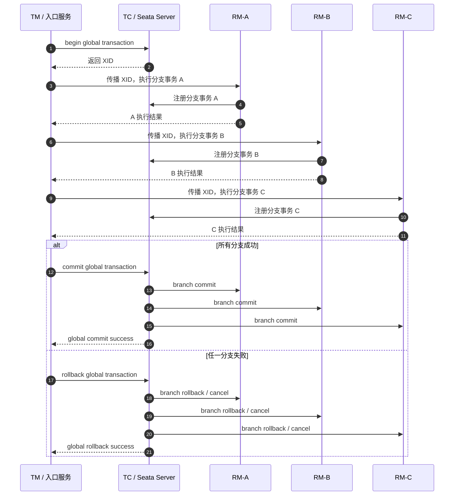
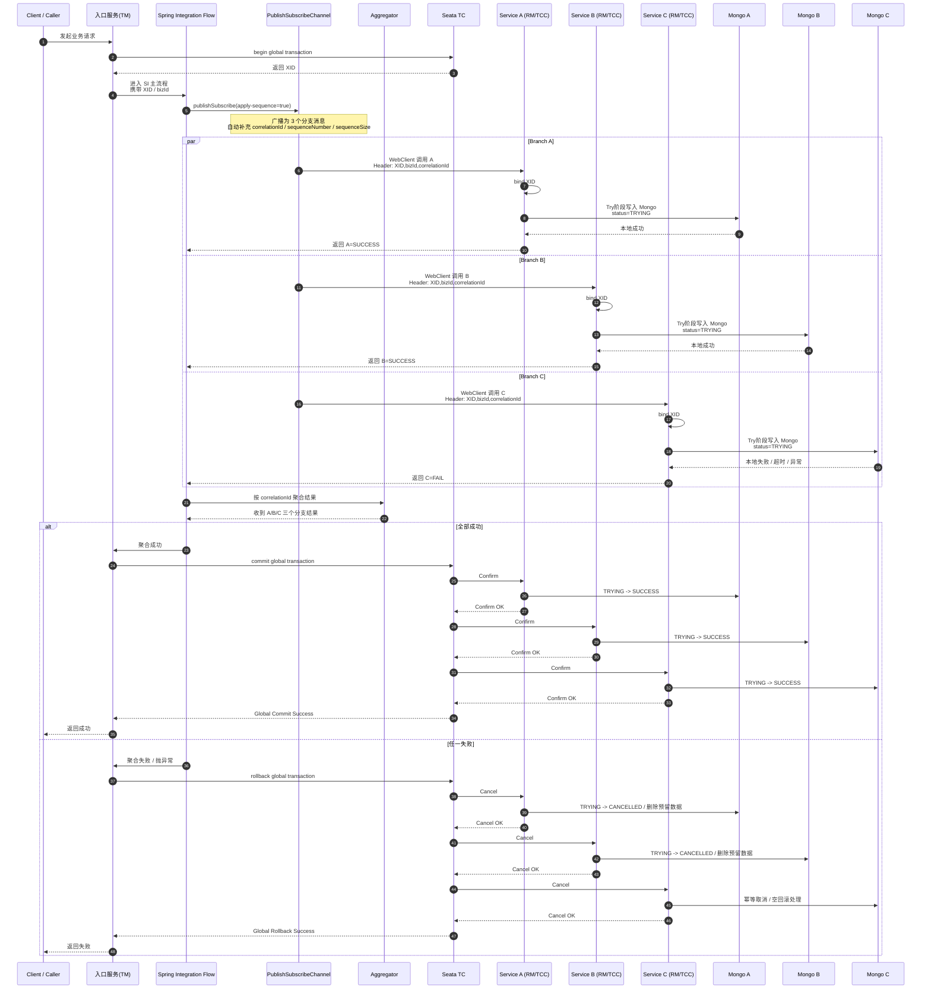

# Seata 分布式事务技术说明（专业版）

## 1. 文档目的

本文档面向技术评审、方案汇报与团队内部分享，系统介绍 Seata 的核心概念、事务模式、执行机制，以及其与 Spring Integration、MongoDB、TCC 模式结合时的职责边界、落地方式与故障处理思路。

文档重点解决以下问题：

- Seata 的核心角色与整体工作机制是什么。
- AT、TCC、XA、Saga 四种事务模式分别适用于哪些场景。
- Spring Integration 与 Seata 在事务场景中分别负责什么。
- 在 MongoDB 场景下，为什么更适合采用 TCC 或 Saga，而不是 AT。
- 当 Seata Server 在 TCC 模式下发生故障时，会带来哪些影响，以及应如何处理。

---

## 2. Seata 概述

Seata 是一个开源的分布式事务解决方案，目标是在微服务架构下提供统一的全局事务协调能力，使多个服务、多个资源之间能够在一个业务操作中实现一致性的提交或回滚。

在单体应用中，本地事务通常由数据库自身保证；而在微服务架构中，一个完整业务往往涉及多个独立服务、多个数据库甚至外部资源。此时，单个数据库事务已经无法覆盖全链路一致性，Seata 的价值就在于此。

从职责上看，Seata 的核心能力并不是替代业务编排，而是提供**跨服务、跨资源的全局事务协调机制**。

---

## 3. Seata 核心角色

Seata 体系中最核心的三个角色如下。

### 3.1 TC：Transaction Coordinator

事务协调者，负责维护全局事务和分支事务的运行状态，并最终决定全局事务是提交还是回滚。TC 可以理解为整个分布式事务的“总调度中心”。

### 3.2 TM：Transaction Manager

事务管理器，负责定义全局事务边界，例如开启全局事务、发起提交或回滚。业务代码中常见的 `@GlobalTransactional`，背后主要由 TM 发挥作用。

### 3.3 RM：Resource Manager

资源管理器，负责管理分支事务对应的具体资源，例如数据库连接、数据源代理、本地事务处理以及向 TC 注册分支事务等。

### 3.4 三者关系

在一个典型的分布式事务调用链中：

- TM 负责定义“事务从哪里开始，到哪里结束”；
- RM 负责执行具体的分支事务；
- TC 负责在全局维度上协调各分支最终提交或回滚。

---

## 4. Seata 支持的事务模式

Seata 目前主要支持四种分布式事务模式：

- AT
- TCC
- XA
- Saga

这四种模式并非简单的“版本升级关系”，而是针对不同业务约束、资源类型和一致性要求提供的不同实现思路。

---

## 5. AT 模式

### 5.1 模式定义

AT（Automatic Transaction）是 Seata 最常见、最容易落地的事务模式，主要面向关系型数据库场景，对业务代码侵入相对较低。

### 5.2 工作原理

AT 模式通过代理数据源，在本地事务执行前后记录必要的镜像信息，主要包括：

- before image：业务 SQL 执行前的数据镜像
- after image：业务 SQL 执行后的数据镜像

当全局事务需要回滚时，Seata 会基于这些镜像与 `undo log` 信息生成反向补偿，将数据恢复到事务前状态。

### 5.3 优势

- 对业务代码侵入小
- 与 Spring Boot、MyBatis、JDBC 等传统 Java 技术栈集成较友好
- 开发与落地成本低
- 适合以数据库更新为核心的中后台系统

### 5.4 局限性

- 更适合关系型数据库
- 依赖数据源代理与 SQL 解析能力
- 对复杂 SQL、非标准更新语句支持受限
- 不适合跨缓存、消息、外部接口等非数据库资源的一致性控制

### 5.5 典型适用场景

- 电商下单
- 库存扣减
- 余额扣减
- 订单状态流转
- 以 MySQL / PostgreSQL + MyBatis / JPA 为主的数据库更新型业务

### 5.6 结论

当系统以关系型数据库更新为主，且希望快速引入分布式事务能力时，AT 通常是首选模式。

---

## 6. TCC 模式

### 6.1 模式定义

TCC（Try / Confirm / Cancel）是一种业务层面的分布式事务模式。它不依赖数据库自动回滚，而是要求业务显式实现三个阶段的操作。

- Try：业务检查与资源预留
- Confirm：正式提交
- Cancel：取消预留并执行补偿

### 6.2 本质理解

TCC 的核心不是“数据库帮你回滚”，而是“业务先冻结资源，之后再根据全局结果决定确认还是取消”。

以账户扣款为例：

- Try：冻结 100 元
- Confirm：正式扣除 100 元
- Cancel：解除冻结 100 元

### 6.3 优势

- 业务可控性强
- 可跨数据库、缓存、消息系统和外部资源
- 不依赖复杂 SQL 回滚
- 适用于高一致性、强业务语义场景

### 6.4 难点

- 对业务侵入较大
- 每个分支都需要实现 Try / Confirm / Cancel
- 需要处理幂等、空回滚、悬挂等经典问题
- 设计成本和测试成本较高

### 6.5 典型适用场景

- 支付与账户体系
- 积分处理
- 券核销
- 金融类强一致性流程
- 涉及数据库之外资源协调的业务

### 6.6 结论

当业务对一致性要求高，且资源动作具备明确的“冻结—确认—取消”语义时，TCC 更适合作为核心方案。

---

## 7. XA 模式

### 7.1 模式定义

XA 是基于数据库 XA 协议实现的两阶段提交模式，属于标准 2PC 思路。

### 7.2 工作机制

XA 模式通常分为两个阶段：

- 第一阶段：Prepare
- 第二阶段：Commit / Rollback

数据库在第一阶段预留提交条件，在第二阶段统一完成提交或回滚。

### 7.3 优势

- 一致性语义明确
- 依赖数据库原生 XA 能力
- 对某些传统企业级事务场景较直接

### 7.4 局限性

- 性能通常弱于 AT
- 锁持有时间可能更长
- 对数据库能力依赖较强
- 在高并发互联网业务中的应用范围通常小于 AT 和 TCC

### 7.5 典型适用场景

- 数据库本身对 XA 支持成熟
- 系统对标准 2PC 有明确要求
- 业务规模相对稳定，性能压力可控

---

## 8. Saga 模式

### 8.1 模式定义

Saga 面向长事务与最终一致性场景。其核心思路不是让所有参与者始终处于强一致事务中，而是把整个业务拆分为多个本地事务，并为每一步定义对应的补偿动作。

### 8.2 工作特点

- 不追求实时强一致
- 强调最终一致性
- 适用于流程长、步骤多、跨系统广的业务

### 8.3 优势

- 更适合长链路业务
- 吞吐量与扩展性通常更好
- 对外部异构系统更友好

### 8.4 挑战

- 业务会经历中间态
- 补偿逻辑设计复杂
- 用户可能短时间观察到不一致状态
- 对业务建模能力要求较高

### 8.5 典型适用场景

- 旅游预订
- 审批流程
- 多系统流程编排
- 能接受最终一致性的复杂业务链路

---

## 9. 四种模式的选型建议

### 9.1 优先选择 AT 的场景

当业务符合以下特征时，建议优先考虑 AT：

- 以关系型数据库为主
- 操作为普通增删改查
- 需要较低改造成本
- 希望尽快落地分布式事务能力

### 9.2 选择 TCC 的场景

当业务具有以下特征时，建议选择 TCC：

- 资源具备冻结、确认、取消语义
- 需要自定义补偿逻辑
- 涉及数据库之外的资源
- 对业务过程可控性要求高

### 9.3 选择 XA 的场景

当系统环境符合以下条件时，可以考虑 XA：

- 数据库对 XA 支持成熟
- 组织更偏传统企业级事务方案
- 可以接受 2PC 带来的性能与锁影响

### 9.4 选择 Saga 的场景

当业务具备以下特点时，更适合 Saga：

- 事务持续时间较长
- 涉及步骤较多
- 存在多个外部系统
- 能够接受短时间不一致

### 9.5 总结建议

从工程实践看，可以用以下规则快速判断：

- **数据库更新型业务**：优先 AT
- **强业务语义、强一致性、跨多资源**：优先 TCC
- **标准 2PC 场景**：考虑 XA
- **长流程与最终一致性场景**：考虑 Saga

---

## 10. Seata 全局事务执行流程

以最常见的全局事务为例，其执行链路如下。

### 10.1 开启全局事务

业务入口方法通过 `@GlobalTransactional` 开启全局事务，TM 向 TC 申请创建全局事务，并获取全局事务 ID，即 XID。

### 10.2 XID 传播

XID 会沿调用链向下游服务传播，使参与方感知自己属于同一个全局事务。

### 10.3 注册分支事务

各参与服务在执行本地事务前，会向 TC 注册自身对应的分支事务。

### 10.4 执行业务逻辑

各分支服务执行本地数据库操作或业务动作。

### 10.5 全局提交或回滚

- 若所有分支执行成功，则由 TC 协调全局提交。
- 若任一分支失败，则由 TC 协调全局回滚。

### 10.6 按事务模式完成回滚或补偿

不同模式下，分支回滚机制不同：

- AT：基于 undo log 自动回滚
- TCC：执行 Cancel
- XA：执行 XA Rollback
- Saga：执行补偿链


### 10.7 全局事务执行流程示意图



---

## 11. Spring Integration 与 Seata 的职责边界

### 11.1 核心结论

如果需要保证 A、B、C 三个服务“要么全部成功，要么全部失败”，这种**跨服务一致性**属于 Seata 的职责，而不是 Spring Integration 的职责。

Spring Integration 主要负责：

- 流程编排
- 消息分发
- 聚合与路由
- 线程模型控制
- 错误流转

Seata 主要负责：

- 全局事务边界定义
- 分支事务协调
- 全局提交或回滚决策

### 11.2 Spring Integration 的事务本质

Spring Integration 的事务，本质上仍然是 Spring 本地事务能力在消息流中的体现。它只能在**同一个线程、同一个本地事务上下文、同一个事务资源**范围内提供一致性控制。

因此，Spring Integration 可以参与本地事务边界，但它不是分布式事务协调器。

### 11.3 Seata 的事务本质

Seata 提供的是**全局事务能力**。入口服务开启全局事务后，下游服务作为参与方加入同一 XID，最终由 TC 决定全局提交还是回滚。

### 11.4 一句话区分

- **Spring Integration 事务**：偏流程内、本地、同线程或同资源的事务边界
- **Seata 事务**：偏跨服务、跨资源的全局事务边界


### 11.5 职责边界示意图

```text
[Client]
   |
   v
[入口服务 @GlobalTransactional]   --> Seata 全局事务入口
   |
   v
[Spring Integration Flow]        --> 流程编排层
   |
   +--> publishSubscribe         --> 并发分发 A / B / C
   |      +--> A 服务            --> 分支事务参与者
   |      +--> B 服务            --> 分支事务参与者
   |      +--> C 服务            --> 分支事务参与者
   |
   +--> aggregate                --> 聚合所有分支结果
          |
          +--> 全成功 --> Seata Commit
          |
          +--> 任一失败 --> Seata Rollback
```

---

## 12. Spring Integration + Seata 场景职责拆解

假设存在如下流程：

```text
Spring Integration
   -> publishSubscribe
       -> 调 A
       -> 调 B
       -> 调 C
```

若 A、B 成功，C 失败，则应分两种情况理解。

### 12.1 只有 Spring Integration，没有 Seata

此时 Spring Integration 能做到的是：

- 并发调用 A / B / C
- 收集各分支返回结果
- 在失败时走错误流、抛异常或形成失败聚合结果

但它**无法自动回滚 A、B 已经成功提交的跨服务数据**。原因在于：

- A / B / C 是独立服务
- 各自拥有独立资源与独立数据库操作
- Spring Integration 不是分布式事务管理器

因此，没有 Seata 时，跨服务回滚只能依赖：

- 业务补偿逻辑
- 状态机
- 最终一致性方案
- 重试或人工修复机制

### 12.2 使用 Seata

此时职责划分变为：

- Spring Integration 负责流程编排、分发与聚合
- Seata 负责全局事务一致性控制

即：

```text
@GlobalTransactional
入口流程开始
   -> SI publishSubscribe 分发 A / B / C
   -> A / B / C 作为 Seata 分支事务参与者
   -> 若任一分支失败
   -> Seata 触发全局回滚
```

### 12.3 结论

在该场景中，全局事务本身归 Seata 管理；Spring Integration 仅作为业务编排层承载调用链路。

---

## 13. 聚合决策在整体事务中的作用

在使用 `publishSubscribe + aggregate` 的场景下，真正决定“整体事务是否成功”的关键，不是消息是否被发送，而是聚合器最终给出的整体结果。

推荐的整体思路如下：

1. 主流程开启 Seata 全局事务
2. Spring Integration 通过 `publishSubscribe` 并发调用 A / B / C
3. 各分支返回各自的 Try / 执行结果
4. `Aggregator` 按关联键收齐全部结果
5. 若全部成功，则主流程正常结束，触发全局提交
6. 只要有一个失败，则抛出异常，触发全局回滚

这意味着：

- `publishSubscribe` 负责并发分发
- `aggregate` 负责收集并形成全局判断
- “异常抛出后触发 Seata 回滚”属于全局事务协调能力

---

## 14. MongoDB 场景下的事务模式选择

### 14.1 为什么 MongoDB 不适合直接套用 AT

AT 模式本质依赖关系型数据库的数据源代理、SQL 解析、before image / after image 与 undo log 机制。因此，它并不适合直接用于 MongoDB 这类非关系型数据库场景。

### 14.2 MongoDB 场景更适合的模式

如果 A / B / C 均基于 MongoDB，则应优先考虑：

- TCC
- Saga

而不是期望 Seata 像 AT 那样“自动反向回滚 MongoDB 数据”。

### 14.3 正确认识 Mongo + Seata 的关系

在 Mongo 场景中，Seata 负责的是：

- 定义全局事务边界
- 协调整体提交或回滚时机

真正“如何回滚业务数据”，则需要依赖：

- TCC 的 Cancel 逻辑
- 或 Saga 的补偿逻辑

也就是说：

> Seata 负责统一决策是否回滚，业务服务负责真正执行回滚补偿。

### 14.4 推荐的 TCC 落地模型

在 Mongo + TCC 场景中，可将业务状态设计为：

- Try：写入 `TRYING` 状态的预留数据
- Confirm：将状态更新为 `SUCCESS`
- Cancel：删除预留数据或将状态更新为 `CANCELLED`

---

## 15. publishSubscribe 场景下的 XID 传播问题

这是 Spring Integration 与 Seata 结合时最容易被忽略的一个关键问题。

### 15.1 问题本质

`PublishSubscribeChannel` 在配置 executor 后通常会并发执行，而 Seata 的事务上下文默认与线程绑定。线程切换后，如果没有显式传播 XID，则子线程可能无法加入同一个全局事务。

### 15.2 典型风险

表面上看，A / B / C 位于同一条流程中；但若 XID 未正确传播，实际可能变成：

- A、B、C 各自独立执行
- 只有入口方法处于全局事务中
- 子分支并未真正参与同一个全局事务

这样即使 C 失败，A、B 也可能不会被纳入全局回滚。

### 15.3 推荐做法

1. 在主流程开启 `@GlobalTransactional`
2. 将 XID 放入 Message Header
3. 在 `publishSubscribe` 子分支执行前重新绑定 XID
4. 使用 WebClient 调下游时，将 XID 放入请求头
5. 下游服务收到请求后再次绑定 XID

---

## 16. Spring Integration + Seata + Mongo 的推荐架构

### 16.1 架构定位

建议将不同组件职责划分如下：

- **Spring Integration**：负责编排、分发、聚合与错误路由
- **Seata**：负责全局事务协调
- **MongoDB 本地事务**：负责单服务内部一致性
- **TCC / Saga**：负责 Mongo 数据补偿回滚

### 16.2 推荐执行模型

### 16.3 Spring Integration + Seata + Mongo + publishSubscribe + aggregate 时序图


* 入口服务用 **Spring Integration** 编排流程
* 用 **publishSubscribe** 并发调用 A / B / C
* 用 **aggregate** 等待三个分支结果
* 用 **Seata TCC** 做全局事务协调
* 每个服务内部如果有多文档写入，用 **Mongo 事务**
* Mongo 事务要求 **Replica Set / Sharded Cluster**，不能是普通 standalone；而 `publishSubscribe` 下如果后面接 `Aggregator`，要开启 `apply-sequence`，这样才会自动带上 `CORRELATION_ID / SEQUENCE_NUMBER / SEQUENCE_SIZE`。([MongoDB][1])

---

## 1）完整时序图



**publishSubscribe 和 aggregate 属于 SI；begin / commit / rollback 属于 Seata；Mongo 只负责各服务内部本地事务与数据持久化。** Spring Integration 自己不提供跨服务原子提交，它提供的是消息流事务支持与流程编排；Seata 的 `GlobalTransaction` 才负责全局 begin / commit / rollback.

主流程：

```text
开启 Seata 全局事务
 -> SI publishSubscribe 调 A / B / C
 -> SI aggregate 等待结果
 -> 任一失败则抛异常
 -> Seata 发起全局回滚
 -> 各服务执行 Cancel / 补偿
```

各服务：

```text
Try:
  写入 status=TRYING 的预留记录

Confirm:
  更新为 SUCCESS

Cancel:
  删除 TRYING 记录或更新为 CANCELLED
```

---

## 17. Seata TCC 模式下 Server 故障影响分析

在只考虑 TCC 模式时，Seata Server（TC）故障带来的核心问题，不是普通意义上的“数据库回滚失败”，而是：

> Try 可能已经执行，但 Confirm / Cancel 无法继续协调，导致业务资源长期停留在“已预留、未决议”的中间状态。

### 17.1 Confirm 延迟

若全局事务本应提交，但 TC 故障，则 Confirm 无法按时下发，可能出现：

- 余额长期冻结
- 库存长期锁定
- 订单状态长时间停留在处理中

### 17.2 Cancel 延迟

若全局事务本应回滚，但 TC 故障，则 Cancel 无法及时执行，可能出现：

- 冻结余额未释放
- 预扣库存未归还
- 预占资源长时间占用

### 17.3 二阶段执行中断

若多个分支中，部分已完成 Confirm / Cancel，部分尚未完成，而此时 TC 故障，则系统会进入“部分二阶段已执行、部分未执行”的中间状态。TC 恢复后会尝试继续推进未完成事务。

### 17.4 核心结论

TCC 场景下最需要关注的，不是是否会立即抛错，而是业务状态是否会在故障期间长期滞留在中间态。


### 17.5 TCC 故障状态流转示意图

```text
Try 已成功
   |
   +--> TC 正常工作 --> 下发 Confirm --> 资源正式提交
   |
   +--> TC 故障 --> Confirm 延迟 --> 资源长期冻结 / 处理中
   |
   +--> TC 故障 --> Cancel 延迟 --> 资源长期占用 / 未释放
   |
   +--> TC 恢复 --> 重试 Confirm / Cancel --> 要求业务具备幂等处理能力
```

---

## 18. TCC 模式下的经典问题

### 18.1 幂等问题

Confirm / Cancel 可能因网络重试、TC 恢复重试等原因被重复调用。因此，二阶段逻辑必须具备幂等性。

### 18.2 空回滚问题

Cancel 到达时，对应的 Try 可能尚未真正成功执行，或者根本未落库。此时 Cancel 仍然必须被正确处理，而不能简单报错。

### 18.3 悬挂问题

若空回滚已经执行，后续迟到的 Try 又到达并成功执行，就会形成事务悬挂，导致系统重新进入不应出现的“冻结中”状态。

### 18.4 结论

TC 故障、网络抖动、超时重试都会显著放大上述三类问题，因此 TCC 的工程实现必须围绕这三类问题进行设计。

---

## 19. TCC 模式下的设计建议

### 19.1 Try 只做资源冻结，不做最终扣减

正确做法应是：

- 账户：可用余额减少，冻结余额增加
- 库存：可售库存减少，冻结库存增加
- 订单：状态置为 `PROCESSING` 或 `PENDING`

Try 阶段不应直接做最终状态变更，否则在 Confirm / Cancel 延迟时将难以恢复。

### 19.2 建立事务控制记录表

建议为每个分支事务持久化一条事务控制记录，至少包含：

- xid
- branchId
- 业务类型或 actionName
- 当前状态：`TRYING` / `CONFIRMED` / `CANCELED`
- Try 是否成功标记

### 19.3 Confirm / Cancel 必须幂等

处理原则：

- 已 Confirm：直接返回成功
- 已 Cancel：直接返回成功
- 未处理：执行实际业务逻辑并更新状态

### 19.4 Cancel 必须支持空回滚

若未发现 Try 成功记录，也应将本次 Cancel 记录为已处理，而不是简单报错。

### 19.5 Try 必须防止悬挂

Try 执行前需检查是否已存在当前分支的取消记录。若已被取消，则必须拒绝 Try 执行。

### 19.6 推荐结合 Fence 思路

在生产环境中，建议基于事务控制表或官方推荐的 Fence 思路统一处理幂等、空回滚和悬挂问题，而不建议依赖零散的业务判断临时补漏。

---

## 20. 运维与高可用建议

### 20.1 TC 不应作为单点部署

生产环境下不建议将 Seata Server 作为脆弱的单机临时服务运行，应结合可靠存储和高可用部署方案降低单点故障风险。

### 20.2 关注恢复与重试机制

TC 恢复后通常会继续推进处于提交中、回滚中、超时中的事务。因此，运维层应重点关注恢复重试相关配置与监控。

### 20.3 建立业务巡检机制

即使存在 TC 重试机制，也不应完全依赖框架恢复。建议增加以下巡检能力：

- 扫描长期处于冻结状态的业务单据
- 扫描长时间未完成 Confirm / Cancel 的分支
- 针对异常中间态提供自动或人工补偿入口

---

## 21. 最终结论

### 21.1 关于 Seata 本身

Seata 的本质价值在于：为微服务架构中的多个服务、多个资源提供统一的全局事务协调能力。

### 21.2 关于模式选择

- 关系型数据库更新型业务，优先选择 AT
- 强一致性、强业务语义、跨多资源场景，优先选择 TCC
- 标准 2PC 诉求场景，可考虑 XA
- 长事务与最终一致性场景，适合 Saga

### 21.3 关于 Spring Integration 与 Seata 的关系

Spring Integration 不负责跨服务原子提交，它负责的是编排；Seata 负责的是全局事务协调。两者是协作关系，而不是替代关系。

### 21.4 关于 MongoDB 场景

在 MongoDB 场景下，不应期待 Seata AT 式的自动数据回滚，而应采用 TCC 或 Saga，并通过业务补偿实现一致性。

### 21.5 关于 TCC 故障处理

TCC 模式下，最重要的不是“是否能立刻回滚”，而是能否正确处理资源冻结、中间态滞留、幂等、空回滚与悬挂等问题。

因此，一个成熟的 TCC 方案应至少具备以下能力：

- 冻结式 Try
- 幂等 Confirm / Cancel
- 空回滚处理
- 防悬挂机制
- 事务控制表或 Fence 机制
- 完整的监控、巡检与补偿体系

---

## 22. 总结

> Seata 负责分布式事务的全局协调，Spring Integration 负责业务流程编排；在 MongoDB 场景下，推荐通过 TCC 或 Saga 实现补偿型一致性，并通过幂等、空回滚、防悬挂与高可用治理保障生产可落地性。
